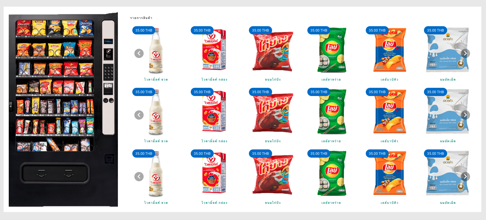

# ระบบตู้สินค้าเหรียญ
## ภาพประกอบตัวอย่างของระบบ

[](https://github.com/ez-kraivit/smart_vending_machine_typescript_express)

รายละเอียดจำลอง Device Desktop เท่านั้น

- จำลองการซื้อขนมผ่านตู้หยอดเหรียญ
- พัฒนาด้วย JavaScript Framework Vue
- ✨ปรับปรุง Database ไว้ใช้ในอนาคต

## ฟีเจอร์

- ระบบ ทอนเหรียญ 
- ระบบ ตู้หยอดเหรียญแบบ หลากหลายสาขา
- ระบบ มาสเตอร์สินค้า หมายเหตุ สามารถ Clone สินค้าและแก้ไขราคาสินค้าในแต่ละเครื่องได้
- ระบบ ทั่วไป สมาชิก
- ระบบ Refund หากกดสินค้าแล้วแต่ยกเลิก


> การออกแบบไม่ได้เขียน API ทุกเคสเนื่องจากเวลา
> การออกแบบค่อนข้างใช้เวลาในการคิด
> การออกแบบ ต้องแบ่งเวลาออกแบบทั้ง Database , API Design , Development


## เทคโนโลยี

ใช้อะไรในการออกแบบและพัฒนาในโปรเจคนี้

- [Express JS] - fast node.js network app framework
- [Nuxt JS] - frontend user interface
- [Postgres] - database
- [Vuetify] - css framework
- [Node JS] - evented I/O for the backend

## คู่มือการติดตั้ง

แนะนำให้ใช้ Node 14 เพื่อป้องกันความผิดพลาด ในส่วนนี้จะไม่มีในส่วนของการทำ production Deploy มีเพียงแค่ Development

ส่วนของ Backend ให้ทำการติดตั้งตามนี้ 

```sh
cd backend
yarn
yarn add env-cmd //จัดการในส่วนของ config ที่มี env มากกว่า 1 เช่น uat.env , qc.env
yarn add glob //จัดการในส่วนของการอ่าน file and folder 
yarn add typescript 
yarn add ts-node 
yarn start
```

ส่วนของ Frontend ให้ทำการติดตั้งตามนี้

```sh
yarn
yarn dev
```

## API เติมเงินเข้าตู้หยอดเหรียญ
```
curl --location --request POST 'localhost:5230/api/v1/deposit' \
--header 'Content-Type: application/json' \
--data-raw '{
    "_mid":"M123", //เครื่องหยอดเหรียญนั้น ๆ หากมีหลายสาขาก็หลายรหัส
    "_tid":"2KpmkV9jUA3MuSm", //นำมาจาก FE Query ตอนกดสินค้านั้น ๆ 
    "balance": 10 // ำนวนเงินที่เติมเข้าระบบ
}'
```

## ปลั๊กอินที่ใช้ในส่วน BackEnd

มีสองทางเลือกในการใช้ปลั๊กอิน ลดเวลาในการเขียนเองและมีบางส่วนเขียนเองเช่นกัน

| ปลั๊กอิน | วิธีติดตั้ง |
| ------ | ------ |
| glob | yarn add glob |
| bcryptjs | yarn add bcryptjs |
| big.js | yarn add big.js |
| body-parser | yarn add body-parser |
| cors | yarn add cors |
| express | yarn add express |
| joi | yarn add joi |
| jsonwebtoken | yarn add jsonwebtoken |
| pg | yarn add pg |
| typeorm | yarn add typeorm |

## ปลั๊กอินที่ใช้ในส่วน FrontEnd

มีสองทางเลือกในการใช้ปลั๊กอิน ลดเวลาในการเขียนเองและมีบางส่วนเขียนเองเช่นกัน

| ปลั๊กอิน | วิธีติดตั้ง |
| ------ | ------ |
| @nuxtjs/axios | yarn add @nuxtjs/axios |
| @nuxtjs/dotenv | yarn add @nuxtjs/dotenv |
| @nuxtjs/proxy | yarn add @nuxtjs/proxy |
| @nuxtjs/robots | yarn add @nuxtjs/robots |
| core-js | yarn add core-js |
| nuxt | yarn add nuxt |
| vue-server-renderer | yarn add vue-server-renderer |
| vue-template-compiler | yarn add vue-template-compiler |
| vuetify | yarn add vuetify |
| webpack | yarn add webpack |

```sh
127.0.0.1:5230 //BE
127.0.0.1:3000 //FE
```

## ข้อเสนอแนะ

ความคิดเห็นส่วนตัว โจทย์และมุมมองปัญหาที่ได้มาไม่ได้เป็น โจทย์พื้นฐาน แต่เป็น มินิโปรเจคมากกว่า ค่อนข้างใหญ่และใช้หลายส่วนในการแสดงสกิล มีทั้ง Frontend , Backend , SA หรือเป็นความคิดมากของผู้รับโจทย์เอง